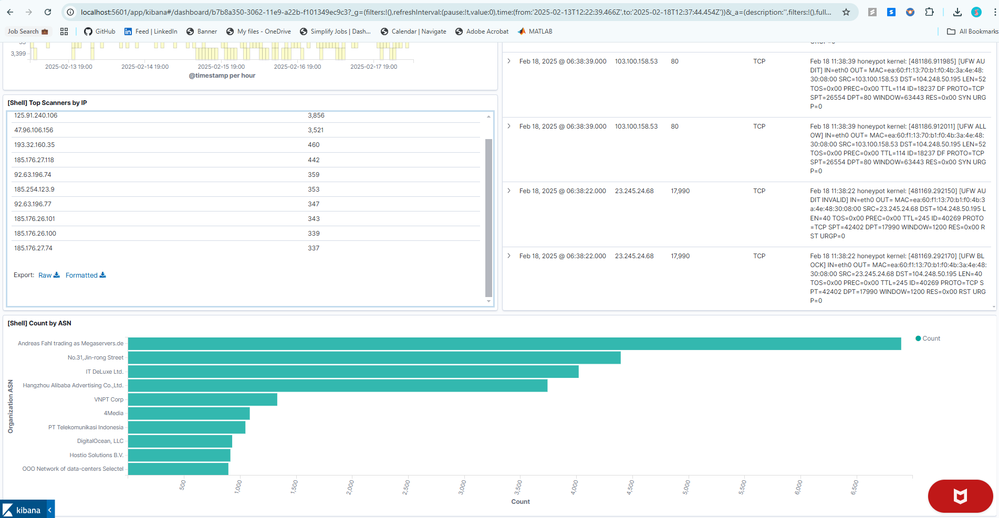

# Intrusion Detection in Real-Time Network Log Data Using ELK Stack

## Overview
This project demonstrates the process of analyzing firewall log data for intrusion detection using the ELK (Elasticsearch, Logstash, and Kibana) stack. The primary goal is to monitor, visualize, and gain actionable insights from network logs in real time. The data used in this project is sourced from a low-interaction honeypot environment designed to capture potential intrusion attempts.

### Why Use ELK for Intrusion Detection?
- **Centralized Monitoring**: ELK provides a robust platform for aggregating, indexing, and querying log data.
- **Real-Time Insights**: Visual dashboards allow immediate detection of suspicious activities.
- **Scalability**: ELK can handle large volumes of log data, making it suitable for enterprise environments.

### Project Impact
- **Enhanced Security**: Enables proactive monitoring of network activity to detect malicious attempts.
- **Automation**: Streamlines the process of log analysis and reporting.
- **Insights**: Identifies patterns in network traffic, helping organizations strengthen their defenses.

---

## Data Description
The data consists of firewall logs recorded from a virtual private server (VPS) on DigitalOcean. The logs cover the timeframe from February 12, 2019, to February 18, 2019. These logs include:
- **Source IP**: IP addresses originating traffic.
- **Destination Port**: Targeted ports.
- **Protocols**: Network protocols used.
- **Actions**: Recorded actions such as allowing or blocking requests.

### Goals:
1. Identify top attacking IP addresses.
2. Analyze traffic by protocol and ports.
3. Visualize geographic sources of traffic.
4. Detect patterns that could indicate port scans or brute force attacks.

---

## Procedure

### **Step 1: Setting Up the ELK Stack**
- **Tools Used**:
  - Elasticsearch (for data storage and querying).
  - Kibana (for visualization and dashboards).
- **Steps**:
  1. Start the ELK stack using `docker-compose`.
  2. Verify services are running:
     - Elasticsearch: [http://localhost:9200](http://localhost:9200)
     - Kibana: [http://localhost:5601](http://localhost:5601)

### **Step 2: Importing Log Data**
1. Access Kibana and navigate to the **Discover** tab.
2. Use the "Data Visualizer" to upload the log file (`ufw.log`).
3. Apply Grok patterns to parse log fields (e.g., `source_ip`, `protocol`, `destination_port`).
4. Create the `ufw_logs` index pattern in Kibana and set `@timestamp` as the time field.

### **Step 3: Creating Visualizations**
1. Import the provided `dashboard.json` file through **Management > Saved Objects**.
2. Associate visualizations with the `ufw_logs` index pattern.
3. Open the `[Shell] UFW` dashboard to visualize the data.

### **Step 4: Adjusting Time Range**
1. Set the time range in Kibana to match the dataset (Feb 12, 2019 - Feb 18, 2019).
2. Refresh the dashboard to view data in real time.

### **Step 5: Visualization Insights**
Key visualizations include:
- **Top Attacking IPs**
- **Traffic by Country and Ports**
- **Heatmap of Source IPs**
- **Area Chart of Top 10 IPs by Percentage**

---

## Visual Outputs
The following images showcase the visualizations:

### Dashboard Overview


### Detailed View of Visualizations



### Discover Tab


---

## Conclusion
This project demonstrates the power of the ELK stack for network monitoring and intrusion detection. By leveraging Elasticsearch for indexing, Kibana for visualization, and Grok patterns for parsing, we effectively analyze network logs in real time. This approach enhances situational awareness and empowers organizations to proactively defend against cyber threats.

---

## How to Run
1. Clone this repository.
2. Start the ELK stack using `docker-compose`:
   ```bash
   docker-compose up
   ```
3. Import the data into Elasticsearch via Kibana.
4. Navigate to the `[Shell] UFW` dashboard in Kibana to view visualizations.

---

Feel free to reach out for questions or feedback!
